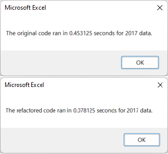
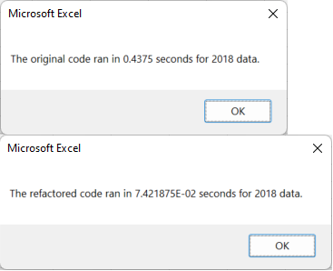

# stock-analysis

Week2 VBA project

---
## Overview of Project

Utilizing stock price and volume data, write VBA Macros to determine total daily volumes and annual returns for a selection of stocks. 

---
### Purpose

In this Module we wrote our first VBA macros, then went back and cleaned them up, or "Refactored" them, to run faster and more efficiently. 

---
## Background

We were presented with a limited amount of simple daily stock market data and asked to process a subset of that data in certain ways. With just 73 lines responsible for its execution, the code accesses a pair of workbooks containing daily volume, Open, High, Low, Close and Adjusted Closing prices, then outputs simple annual analysis for each ticker symbol. This output consists of the Total Annual Volume of trades as well as the annual return, expressed as a percentage. The output is then formatted, and color coded for easy interpretation with an additional subroutine. 

We then took our macro and cleaned it up, reorganizing the layout and bringing external macros inside the original.

---
## Results

The organization of the information in the refactored code certainly helps it run faster, despite it being only one line shorter, at 72 lines of executable code. The declaration of variables before the callout to open the workbook seems to be one major improvement, as is the inclusion of the display formatting in the same script. 

Our original code ran in 0.45 for 2017 data, and 0.44 seconds for 2018 data. After refactoring, the resultant efficiencies in the code are undeniable, with the script running in just 0.08 seconds for 2017 data, and 0.07 seconds for 2018 data.

---

---

---
#### We can see the more efficient layout of the code in these two examples:

#### First, our nested loops:
---
```
 For i = 0 To 11
                    
                    ticker = tickers(i)
                    
                    totalVolume = 0
   
   Worksheets(yearValue).Activate
   
    For j = 2 To RowCount
       
'5a) Find total volume for current ticker
                
                	If Cells(j, 1).Value = ticker Then

                    	totalVolume = totalVolume + Cells(j, 8).Value

                	End If
                
'5b) get starting price for current ticker
       
                	If Cells(j - 1, 1).Value <> ticker And Cells(j, 1).Value = ticker Then

                    	startingPrice = Cells(j, 6).Value

                	End If
        
'5c) get ending price for current ticker

            
                If Cells(j + 1, 1).Value <> ticker And Cells(j, 1).Value = ticker Then

                    endingPrice = Cells(j, 6).Value
            
                End If
                
            Next j
'6) Output data for current ticker
        
        Worksheets("All Stocks Analysis").Activate
        
        Cells(4 + i, 1).Value = ticker
        
        Cells(4 + i, 2).Value = totalVolume
        
        Cells(4 + i, 3).Value = endingPrice / startingPrice - 1

                 
        Next i
```    
#### Compare this to the refactored code, featuring simpler consecutive loops:
---
```

    For i = 0 To 11
        tickerVolumes(i) = 0
        tickerStartingPrices(i) = 0
        tickerEndingPrices(i) = 0
        
    Next i
        
    ''2b) Loop over all the rows in the spreadsheet.
    For i = 2 To RowCount
    
        '3a) Increase volume for current ticker "totalVolume = totalVolume + Cells(j, 8).Value"
        
        tickerVolumes(tickerIndex) = tickerVolumes(tickerIndex) + Cells(i, 8).Value
        
        
        '3b) Check if the current row is the first row with the selected tickerIndex.
        
        
        If Cells(i - 1, 1).Value <> tickers(tickerIndex) And Cells(i, 1).Value = tickers(tickerIndex) Then
        
            tickerStartingPrices(tickerIndex) = Cells(i, 6).Value
        
        End If
        
        '3c) check if the current row is the last row with the selected ticker

        
        If Cells(i + 1, 1).Value <> tickers(tickerIndex) And Cells(i, 1).Value = tickers(tickerIndex) Then
        
            tickerEndingPrices(tickerIndex) = Cells(i, 6).Value
        
        End If
            
        '3d Increase the tickerIndex.
            
         If Cells(i + 1, 1).Value <> tickers(tickerIndex) And Cells(i, 1).Value = tickers(tickerIndex) Then
            
            tickerIndex = tickerIndex + 1
        
        End If
    
    Next i
    
    '4) Loop through your arrays to output the Ticker, Total Daily Volume, and Return.
    For i = 0 To 11
        
        Worksheets("All Stocks Analysis").Activate
        
        Cells(4 + i, 1).Value = tickers(i)
        
        Cells(4 + i, 2).Value = tickerVolumes(i)
        
        Cells(4 + i, 3).Value = tickerEndingPrices(i) / tickerStartingPrices(i) - 1

```

## Summary

Writing more efficient code is an advantage to the developer and the consumer. More efficient code is easier to read and understand for the people you work with. But by far the largest advantage of clean, efficient code is that it places fewer demands on system resources in general, leaving more spare cycles for streaming cat videos.
